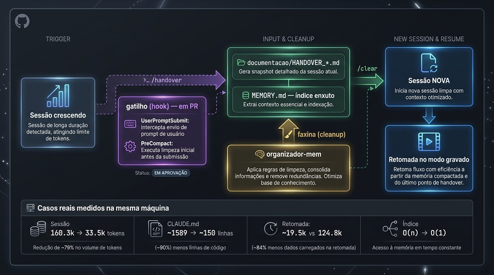
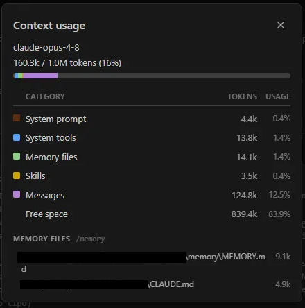
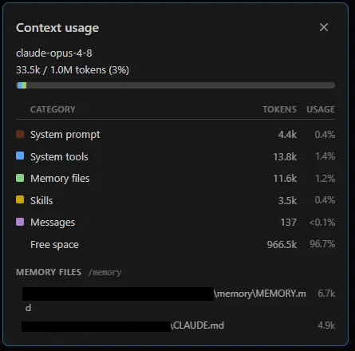
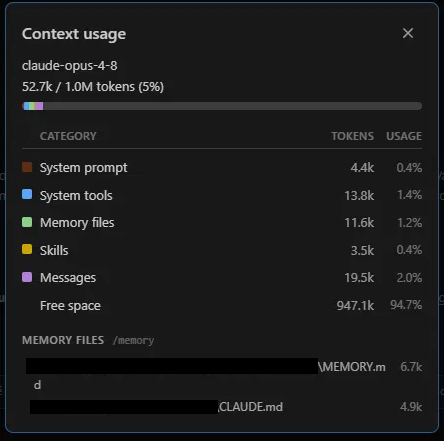

# 🪙 skills — Token Economy for Claude Code

### Duas skills para parar de pagar pedágio de contexto a cada sessão
🇧🇷 Made in Brazil

---


<p align="center">
   HANDOVER_*.md + MEMORY.md --/clear--> Sessão NOVA (lê a linha RETOMADA, abre o handover) --> Retomada no modo gravado (rapida ou verificada). Gatilho (hook): UserPromptSubmit avisa em +80k, PreCompact(auto) é a última chamada. Casos reais medidos na mesma máquina: sessão 160.3k->33.5k tokens após /handover+/clear; retomada ~19.5k vs 124.8k arrastados (~84% menos); CLAUDE.md ~1589->~150 linhas de núcleo (teto ~90% por sessão, média menor com p~0.50 de abertura de satélite); índice 9.1k->6.7k tokens, estável, O(n)->O(1)." width="100%">
</p>

---

## ⚡ TL;DR

> **Contexto é caro e finito. Estas duas skills param o vazamento e limpam o que já vazou.**

- `organizador-mem` — **enxuga** um arquivo de contexto grande (`CLAUDE.md`, memória) separando o que é sempre-relevante do que é sob-demanda.
- `handover` — **estanca** a perda de fio ao dar `/clear`, destilando a sessão em 3 camadas de custo + um cap que impede a memória de inflar de novo.
- `handover-nudge-hook` — **avisa a hora** de dar o `/handover`, medindo o crescimento da conversa a cada turno (com trava de valor e rota de silêncio embutidas).

👉 Uma faz a faxina. A outra impede que suje de novo. O hook avisa a hora. Juntos fecham o ciclo.

---

## 🔥 A dor (talvez você reconheça)

Toda sessão do Claude Code paga pedágio: reler os arquivos de instrução do projeto (`CLAUDE.md`, memória, handovers) — inteiros, sempre, mesmo quando 90% daquilo não toca a tarefa do dia. Eu vivi esse ciclo num projeto real, e essas duas skills nasceram dele. Cada uma ataca uma metade do problema; as dores específicas estão na seção de cada skill.

> ⚠️ **Sobre os percentuais:** os números abaixo são **casos reais que eu observei**, não promessa. O ganho depende do tamanho do seu arquivo e de quanto dele é "sempre-relevante" versus "sob demanda". Trate como ordem de grandeza.

> 🌐 **Agnósticas de domínio.** Nasceram num projeto real meu, mas a mecânica serve qualquer repo com um arquivo de contexto grande demais ou uma memória que precisa sobreviver ao `/clear`. Os exemplos dentro de cada `SKILL.md` são só isso — exemplos.

---

## 🧹 `organizador-mem`

**A dor.** Meu `CLAUDE.md` tinha mais de 1500 linhas. Toda sessão lia tudo — mesmo quando 90% daquilo não tinha nada a ver com a tarefa do dia. Eu pagava, a cada turno, por regras de subsistemas que eu nem ia tocar.

**O que ela faz.** Separa o arquivo grande em **núcleo sempre-relevante** + **documentos-satélite sob demanda**, ligados por um *mapa* enxuto. O corte de cada pedaço é decidido por um **agente que lê e entende a semântica** — não é split cego por regex ou heading. Quando dois trechos parecem acoplados, ou uma seção cabe em dois tópicos, a skill **para e pergunta** antes de aplicar. Aprendi da pior forma que split mecânico fragmenta raciocínio ao meio.

**Por que melhora.** O modelo passa a ler o núcleo curto + o mapa, e só abre o satélite que a tarefa realmente toca. O custo de leitura deixa de ser "o arquivo todo" e vira "núcleo + o que importa agora".

**Quanto rendeu.**

| Antes | Depois | Redução |
|---|---|---|
| `CLAUDE.md` ~1589 linhas lidas/sessão | ~150 linhas de núcleo + mapa | **~90%** |

Faixa típica que eu esperaria: **60–90%**, quando a maior parte do arquivo é tópico-específica.

> ⚖️ **Leia esse `~90%` como teto, não média — e aqui está o porquê honesto.** Esta skill não *apaga* token pago (isso é o `handover`, abaixo); ela **difere** o custo: o satélite só é lido quando a tarefa o toca. O ganho por sessão vale `~90%` integral **só na sessão que não abre satélite nenhum**. Quando abre, você re-paga aquele satélite, e a economia real vira `Σ(1−pᵢ)·custo_satéliteᵢ − custo_do_mapa`, onde `pᵢ` é a taxa com que cada satélite é aberto. **No meu projeto eu medi `p≈0,50`** (cerca de metade das sessões abre ao menos um satélite de regra) — então a **média** fica materialmente abaixo do teto. Dois corolários: se `p` for alto, o ganho colapsa (você quase sempre paga o satélite mesmo); se você fatiar demais, o custo fixo do mapa pode comer a economia — por isso a skill **pergunta antes de cortar**. O que **não** depende de `p` é a *descoberta*: o mapa garante que você sempre sabe que a regra existe e onde está. Isso é ganho **qualitativo** (aderência), não de token — e é honestamente a metade mais valiosa.

**A intuição, em uma frase:** *nem toda regra é sempre relevante.* Princípios inegociáveis são núcleo — todo turno. A lei de um subsistema só importa quando você mexe nele. O mapa preserva a *descoberta* ("existe uma regra sobre X, abra tal doc") sem pagar o *conteúdo* até precisar.

**O que controla em `.claude/`.** Vive em `.claude/skills/organizador-mem/SKILL.md`. **Reorganiza** o seu `.claude/CLAUDE.md` (ou qualquer arquivo que você apontar) e cria a pasta de satélites ao lado (ex.: `documentacao/regras/`). Não toca em código — só na camada de instrução que o Claude carrega.

---

## 📤 `handover`

**A dor.** Tarefa pela metade e um dilema sem saída boa: carregar a conversa inteira pra frente (caríssimo) ou dar `/clear` e recomeçar reexplicando tudo (lento — e você SEMPRE esquece um porquê importante no caminho).

**O que ela faz.** Prepara a **saída limpa** da sessão. Escreve **um** documento seletivo em `documentacao/` — seletivo é regra, não adjetivo: só entra o que git + código + memória **não** contam sozinhos (o *porquê* das decisões com a alternativa descartada, o estado pendente, o próximo passo exato, os riscos). Atualiza um breadcrumb enxuto na memória e declara um **modo de retomada**: `rapida` (próximo passo não toca runtime) ou `verificada` (toca — e aí a sessão nova é obrigada a reconferir o estado vivo antes de afirmar qualquer coisa).

**Por que melhora.** Distribui o estado em **3 camadas de custo diferente**:

| Camada | Carrega quando | Custo |
|---|---|---|
| **Resume** | você retoma *esta* conversa | alto — e morre no `/clear` |
| **Memória-índice** | **toda** sessão nova | baixo — breadcrumb enxuto que aponta |
| **Handover-arquivo** | só quando alguém o abre | zero até ser aberto |

Cada informação fica na camada mais barata que ainda a entrega a tempo.

**Quanto rendeu.** O maior ganho é **estrutural** — e foi um bug meu que me ensinou. A 1ª versão preservava o histórico de retomadas para sempre: cada handover depositava uma linha permanente no índice, crescendo **O(n)** sem ninguém perceber. Esta versão traz um **cap de histórico** (no máximo as **2** retomadas anteriores; o resto delega aos ponteiros duráveis) → crescimento **O(1)**.

| Aspecto | Sem cap | Com cap |
|---|---|---|
| Índice de memória | 96 linhas e subindo | 65 linhas, estável (**redução de ~32%**) |
| Crescimento por sessão | +1 linha permanente (O(n)) | limitado (O(1)) |

Sem o cap, o índice voltaria a inflar em semanas — eu só descobri olhando o painel de context usage e me perguntando por que a memória pesava tanto.

**A intuição, em uma frase:** *a memória é o ÍNDICE — aponta, não repete.* A camada que carrega toda sessão tem que ser a mais enxuta possível: só precisa dizer **qual arquivo abrir** e **qual o próximo passo**. E como "o que era verdade quando escrevi" ≠ "o que é verdade agora", o modo `verificada` existe para uma coisa: economia de token **nunca** vale uma afirmação falsa sobre o runtime.

**O que controla em `.claude/`.** Vive em `.claude/skills/handover/SKILL.md`. **Escreve** o handover em `documentacao/` e **mantém** o índice de memória (`MEMORY.md` + `memory/*.md`) enxuto e capado. É a disciplina de *entrada* da memória; o `organizador-mem` é a *faxina*.

---

## 🔗 Por que as duas juntas

Aqui está a parte que eu demorei a enxergar: `handover` **alimenta** a memória a cada saída de sessão; `organizador-mem` a **reorganiza** quando ela incha. Sem a primeira disciplinada (com o cap), a segunda vira **enxugar gelo** — cada handover deposita mais uma linha e o índice que você acabou de emagrecer engorda de novo. Juntas: entrada capada + faxina agêntica.

---

## ⏰ `handover-nudge-hook` — *quando* disparar

As duas skills resolvem o **como** estancar e limpar. Faltava o **quando** — e "quando" é justo o que a gente esquece no meio de uma tarefa boa. Este hook (`UserPromptSubmit`) mede o **crescimento da conversa** a cada turno e, ao cruzar um limiar, **sugere** um `/handover`.

O número que ele observa **não** é o total da janela — `system`, `tools`, `memória` e `skills` são ~fixos, não é isso que o handover economiza. Ele mede **`total_atual − baseline_da_sessão`**: o custo de re-pagar a *conversa* ao arrastá-la para frente. É esse delta que dispara.

Duas travas o impedem de virar spam:

- **Trava de valor.** Ele não manda "abra um handover" — manda *aplicar o Passo 0 primeiro*. Exploração descartável sem estado durável recebe *"aqui basta memória"*, **nunca** um handover vazio com timestamp.
- **Rota de silêncio.** A oferta é um `AskUserQuestion` com *preparar / agora não / **silenciar nesta sessão***, sem repetir entre níveis — o antídoto da fadiga de alerta, que mataria o mecanismo.

Limiar **configurável** (default 80k — `n=1`, ordem de grandeza) e cada aviso vai pro log, pra você calibrar **com dado** em 10–15 sessões. Instalação e detalhes em [`handover-nudge-hook/`](handover-nudge-hook/).

---

## 📊 Evidência (uma sessão real)

O ciclo inteiro medido no painel *Context usage* do Claude Code — os três momentos de uma mesma tarefa (rodapés anonimizados de propósito):

<p align="center">
  
  
  
</p>

| | 1 · Sessão inchada | 2 · Depois do `/clear` | 3 · Depois da retomada |
|---|---|---|---|
| **Total da janela** | 160.3k | 33.5k | 52.7k |
| **`Messages` (a conversa)** | **124.8k** | 137 | **19.5k** |
| **`MEMORY.md` (índice)** | 9.1k | 6.7k | 6.7k |

**A manchete não é o total — é a conversa.** Retomar o fio custou **19.5k** de `Messages` contra os **124.8k** que a sessão inchada carregava: o estado voltou por **~16% do custo** de arrastar a conversa (**~84% de desconto**). Não é "economizei tokens" — é recuperar o estado de uma sessão de 124k **pagando 19k**.

**E o imposto permanente também caiu:** o índice de memória saiu de **9.1k → 6.7k** por sessão (−26%) e o *cap* o mantém estável — você não re-paga esse delta a cada `/clear`. Multiplicado pelas suas sessões, é o ganho composto do sistema.

> Números de **uma** sessão observada — ordem de grandeza, não promessa. É exatamente para transformar isto em calibragem que o `handover-nudge-hook` loga cada evento.

---

## 🚀 Como usar

Estrutura do repositório:

```
skills/
├── organizador-mem/
│   └── SKILL.md
├── handover/
│   └── SKILL.md
└── handover-nudge-hook/        # não é skill — é um hook UserPromptSubmit
    ├── handover_nudge.py
    ├── handover-nudge.config.json
    └── README.md
```

Instalação das **skills**: copie cada pasta para o diretório de skills que o seu setup lê — tipicamente `.claude/skills/` no projeto, ou o diretório global. O **hook** se instala diferente (é um `UserPromptSubmit` no `settings.json`) — ver [`handover-nudge-hook/README.md`](handover-nudge-hook/README.md).

```bash
git clone <este-repo> && cp -r skills/organizador-mem skills/handover <seu-projeto>/.claude/skills/
```

Cada `SKILL.md` é autocontido (frontmatter `name` + `description`). O Claude carrega a skill quando a tarefa casa com a `description`, ou quando você a chama pelo nome.

O ciclo de vida de uma sessão longa com o `handover` é sempre este:

| Você quer... | Comando | O que acontece |
|---|---|---|
| **Fechar a sessão sem perder o fio** | rode `/handover` | destila a tarefa em handover + memória e declara o modo de retomada |
| **Limpar o contexto** | `/clear` | zera esta conversa — o handover e a memória já estão em disco, nada se perde (só **você** executa; o modelo não pode) |
| **Retomar depois** | sessão NOVA → *"retomar o handover"* (ou `/handover`) | lê a linha `RETOMADA` do `MEMORY.md`, abre o handover indicado e segue o modo gravado |

👉 A regra de ouro: **`/clear` só depois do `/handover`**. O handover é o que torna o `/clear` seguro.

---

## 🤝 Testou? Me conta

Os percentuais daqui só valem o que valem porque vieram de caso real — e mais casos reais só melhoram a calibragem. Se rodar num projeto seu e os números baterem (ou **não** baterem), abre uma issue: o disclaimer lá de cima fica mais honesto a cada dado que chega.

Feito em Fortaleza. 🇧🇷
